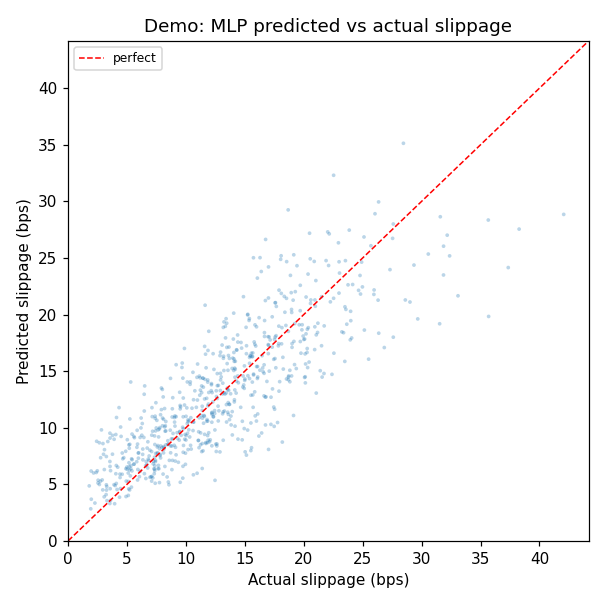
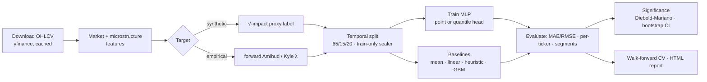

# Slippage Predictor — Estimating Execution Costs from Intraday Market Data

[](https://github.com/francescopionatale/slippage-predictor/actions/workflows/ci.yml)
[](LICENSE)
[](pyproject.toml)
[](#testing--quality)

> **TL;DR** — A research-grade, fully-tested framework for modelling order
> execution cost (slippage, in bps) from public intraday OHLCV data. It
> pairs a methodologically careful synthetic-proxy pipeline (no look-ahead,
> temporal hold-out, walk-forward CV) with an **empirical, non-circular
> real-data track** (forward Amihud illiquidity / Kyle's λ), a **strong
> GBM baseline**, a **distributional quantile head**, and **statistical
> significance testing** — so the headline "MLP wins" claim is actually
> falsifiable.

**Project status:** complete research / portfolio artifact. The scope is
intentionally frozen around *methodology* (not production prediction); the
"future extensions" list below is the roadmap, not missing work.

A neural-network framework for estimating expected slippage of financial
orders from public intraday OHLCV data. The project demonstrates a
methodologically correct approach to execution-cost modelling — no
look-ahead bias, explicit proxy calibration, temporal hold-out
validation, walk-forward CV, and rigorous baseline comparison — rather
than claiming production-grade prediction.



*Above: `make demo` output — MLP predictions vs the synthetic slippage
label on the committed offline sample (runs in <1 min, no network).*

📖 **Detailed methodology lives in [`docs/`](docs/):**
- [`docs/methodology.md`](docs/methodology.md) — split design, baselines, model, walk-forward CV.
- [`docs/feature_engineering.md`](docs/feature_engineering.md) — market + spread + synthetic-order features.
- [`docs/proxy_construction.md`](docs/proxy_construction.md) — square-root impact formula and rationale.

---

## Pipeline at a glance



---

## What is slippage?

Slippage is the difference between the price at which a trade is
decided and the actual execution price. It is always expressed as a
cost:

```
Buy order:   slippage = execution_price − arrival_price
Sell order:  slippage = arrival_price − execution_price
slippage_bps = 10 000 × slippage / arrival_price
```

---

## Data source

Hourly OHLCV bars from Yahoo Finance (`yfinance`, `interval="1h"`),
covering ~2 years (yfinance restricts 1h history to ~730 days). To
use 5-minute bars on a shorter window, pass `--interval 5m` to
`scripts/download_data.py`.

---

## Installation

Requires **Python ≥ 3.12** (3.13 is tested in CI).

```bash
git clone https://github.com/francescopionatale/slippage-predictor.git
cd slippage-predictor
make install           # creates .venv, installs editable + dev deps
```

After install, three console scripts are on PATH:
`slippage-download`, `slippage-train`, `slippage-eval`.

---

## Quick start

```bash
# 0. Zero-network demo on the committed sample (<1 min): trains, evaluates,
#    runs a significance test, and writes docs/assets/demo_pred_vs_actual.png
make demo

# 1. Download data (cached as parquet after first run)
make data

# 2. Train the canonical MLP + evaluate on the test set
make train
make eval

# 3. Run the full diagnostic pipeline (sweep, walk-forward, residuals,
#    per-ticker breakdown, self-contained HTML report)
make report

# Shortcut: train + eval + full report
make all

# Tests (unit + integration, with coverage gate)
make test
```

The diagnostic HTML lands at `results/comparisons/report.html` with
PNGs base64-embedded — share it as a single file.

Extra scientific entry points:

```bash
python scripts/ablation_circularity.py   # quantify label circularity (honesty check)
python scripts/run_empirical.py           # real-data track: forecast Amihud illiquidity
```

---

## Scientific rigor & capabilities

This repo is explicit about the central limitation of synthetic-label
work (the label is a closed-form function of the features) and ships the
tooling to *measure and move past* it:

- **Empirical, non-circular target** ([`proxy/empirical.py`](src/slippage/proxy/empirical.py)) —
  a forward-looking Amihud-illiquidity / Kyle's-λ label the model must
  genuinely forecast. Run it with `scripts/run_empirical.py`.
- **Circularity ablation** ([`evaluation/ablation.py`](src/slippage/evaluation/ablation.py)) —
  retrains with the label-driving features removed and perturbs the
  generator to quantify how much "skill" is just formula re-derivation.
- **Distributional / quantile head** ([`training/quantile.py`](src/slippage/training/quantile.py)) —
  pinball-loss multi-quantile output giving prediction intervals and a
  cost-at-risk, with interval-coverage evaluation.
- **Strong GBM baseline** ([`models/baselines.py`](src/slippage/models/baselines.py)) —
  a fair nonlinear competitor (not the handicapped heuristic). On the demo
  sample the GBM **matches or beats** the MLP — an honest result.
- **Statistical significance** ([`evaluation/significance.py`](src/slippage/evaluation/significance.py)) —
  Diebold-Mariano test on per-observation losses + block-bootstrap MAE
  confidence intervals, replacing the misleading train-seed σ.
- **Microstructure features** ([`features/microstructure.py`](src/slippage/features/microstructure.py)) —
  dollar volume, Amihud, Roll spread, order-flow imbalance, Garman-Klass /
  Parkinson volatility.
- **Config that actually drives the run** — every `configs/*.yaml` value
  (architecture, optimizer, scheduler, proxy params) is threaded through
  the code (`Config.load()` → `train_from_config`), validated by pydantic,
  and reproducible (seeded, deterministic DataLoader).

---

## Repository structure

```
slippage-predictor/
├── configs/                       # YAML defaults — canonical reference
│   ├── data.yaml
│   ├── features.yaml
│   ├── model.yaml
│   ├── proxy.yaml
│   └── training.yaml
├── data/
│   ├── raw/                       # .gitignore'd parquet cache
│   └── processed/
├── src/slippage/                  # the package
│   ├── config.py                  # pydantic config loader
│   ├── paths.py                   # centralised filesystem paths
│   ├── pipeline.py                # data → features → proxy → split
│   ├── walk_forward.py            # expanding-window CV
│   ├── data/                      # loader + temporal split
│   ├── features/                  # market + spread + synthetic-order
│   ├── proxy/                     # square-root impact label + α calibration
│   ├── models/                    # MLP + baselines + PyTorch Dataset
│   ├── training/                  # Huber + Adam + early stop
│   ├── evaluation/                # metrics, segments, per-ticker
│   └── viz/                       # training, diagnostics, features plots
├── scripts/                       # thin CLIs + diagnostic orchestrators
│   ├── download_data.py
│   ├── train.py
│   ├── evaluate.py
│   ├── run_pipeline.py
│   ├── run_experiments.py
│   ├── run_walk_forward.py
│   ├── compare_runs.py
│   ├── plot_pred_vs_actual.py
│   ├── generate_residual_plots.py
│   ├── generate_diversification_plots.py
│   └── build_report.py
├── notebooks/                     # 01-04 narrative notebooks
├── tests/{unit,integration}/      # pytest
├── artifacts/{checkpoints,scalers}/  # .gitignore'd model weights
├── results/                       # .gitignore'd evaluation outputs
├── docs/                          # methodology + feature + proxy docs
├── .github/workflows/ci.yml       # pytest + ruff + mypy on push / PR
├── LICENSE                        # MIT
├── pyproject.toml
└── Makefile
```

---

## Asset universe

11 tickers spanning the liquidity spectrum, two calendar years of
hourly bars:

| Ticker | Sector       | Liquidity profile               |
|--------|--------------|---------------------------------|
| SPY    | ETF          | Ultra-liquid, S&P 500           |
| QQQ    | ETF          | Ultra-liquid, Nasdaq-100        |
| IWM    | ETF          | Liquid, wider spread than SPY   |
| AAPL   | Tech         | Ultra-liquid                    |
| MSFT   | Tech         | Ultra-liquid                    |
| GOOGL  | Tech         | Ultra-liquid                    |
| JPM    | Financials   | Ultra-liquid                    |
| GS     | Financials   | Liquid, rate-sensitive          |
| XOM    | Energy       | Liquid, commodity-adjacent      |
| SLB    | Energy       | Liquid, commodity-adjacent      |
| PRCT†  | Healthcare   | Illiquid small-cap (stress test)|

† Auto-fallback to `MGNI` (Magnite) if PRCT returns fewer than 500
cleaned bars.

Diversification is **cross-ticker**, not cross-regime: yfinance
restricts 1h bars to ~730 days, so all tickers share the same time
window. The illiquid name is included to expose the model to wider
Corwin–Schultz spreads.

---

## Expected results

After running the full pipeline (`make all`), `results/metrics.json`
reports (test set, bps):

| Model      |   MAE  |  RMSE  | MedAE |
|------------|-------:|-------:|------:|
| MLP        |  ≈ 5.3 |  ≈ 9.3 | ≈ 3.2 |
| Heuristic  | ≈ 12.1 | ≈ 20.3 | ≈ 7.3 |
| Linear     |  ≈ 7.9 | ≈ 13.7 | ≈ 5.4 |
| Mean       | ≈ 17.7 | ≈ 30.2 | ≈ 12.9 |

The aggregate MAE is structurally higher than a mega-cap-only
universe: the illiquid name (PRCT/MGNI) has per-ticker MAE ≈ 12.6 bps
vs ≈ 2.5 bps for SPY, and this enters the aggregate. The MLP beats
the heuristic ~2:1 on every ticker individually — see the per-ticker
chart in the diagnostic report.

---

## Known limitations

- **Ticker universe is US equity / ETF only.** Cross-asset
  generalisation (futures, FX, crypto) is not tested.
- **Circular evaluation (synthetic track).** The synthetic slippage
  label is a closed-form function of the same features the model
  observes — on that track the MLP approximates the proxy formula, not
  real execution costs. This is now *measured* by
  `scripts/ablation_circularity.py` and *side-stepped* by the empirical
  track (`scripts/run_empirical.py`). See
  [`docs/methodology.md`](docs/methodology.md) for the full disclosure.
- **Synthetic order distribution.** `order_size_fraction ~ Uniform
  (0.001, 0.05)` and `urgency ~ Uniform(0, 1)` bear no relation to
  any real order-flow distribution.
- **No broker fills or Level-2 features.** The empirical target is an
  OHLCV-derived illiquidity *estimate*, not realised execution cost; a
  production estimator still needs fill records, quotes, and book depth.

---

## Testing & quality

- **130+ tests** (unit + integration) under a **coverage gate**
  (`pytest --cov=slippage --cov-fail-under=80`, currently ≈ 87 %).
- **Determinism** is asserted (two same-seed runs are bit-identical) and
  numeric outputs are pinned by **golden-file** tests.
- **Property-based tests** (`hypothesis`) enforce the proxy's economic
  invariants (non-negativity, monotonicity in size/vol).
- `ruff` + `mypy` (with the pydantic plugin) run clean in CI on Python
  3.12 and 3.13. A `Dockerfile` provides a reproducible CPU environment.

---

## Out of scope (future extensions)

- True rolling walk-forward with model refitting
- Sequence models (LSTM, Transformer) for temporal features
- Hyperparameter optimisation (Optuna)
- Real Level-2 execution data
